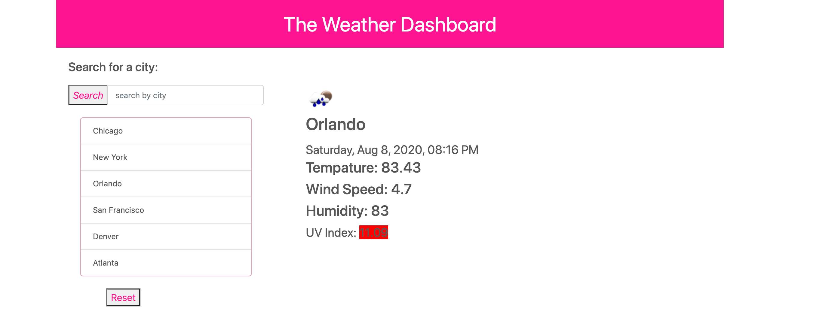
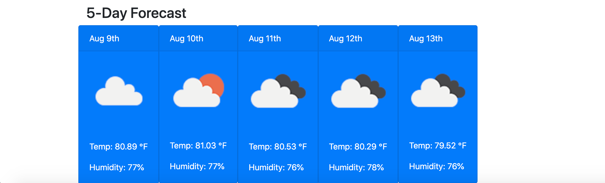

# Weather-Dashboard
# Table of Contents
1. Introduction
2. How to use the weather dashboard
3. Design
4. Technologies used
5. Image
6. About the author
# Introduction
Welcome to the weather dashboard! This is a quick way to look at the weather for any city in the US that you want information for. Great, simple layout and easy to navigate. The user will be able to view the weather for the day as well as a five day forecast.
# How to use the weather dashboard
When the user goes to the weather dashboard they are presented a hot pink header that reads 'Weather Dashboard'. A search bar is located to the left of the page and underneath is a list of cities. This list is a quick reference, to find a city and its weather. Either type in the city you are looking for or click one of the cities on the list. Then that city will appear in the center of the page, with the weather information. The information shown will be; the date for the day, an icon to display the weather, temperature, wind and humidity. To choose another city, click on one of the cities listed or type in the city you desire and the page will refresh. A five-day forecast will appear at the same time as the daily forecast, near the bottom of the page.
# Design
The main color used for the app is pink. This color was chosen to provide the user with a fun and playful interface.  
# Technologies used
* Bootstrap
* Javascript
* Weather API
# Img

# About the author
Teresa Heidt Follow me on Instagram @teresaheidt and Facebook: Teresa Heidt

